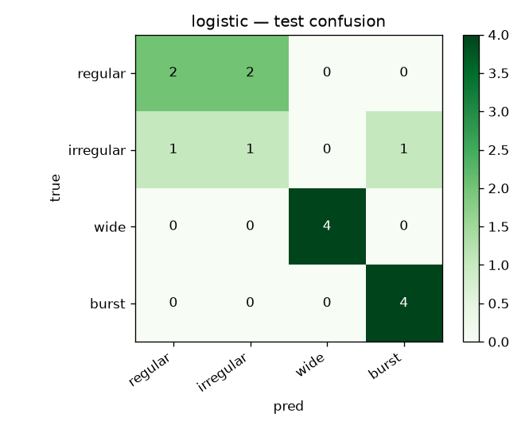

# MotionCode

**Scientific ML / ECG-like classification — reproducible pipelines, baselines, honest metrics.**

Spec: [`SPEC.md`](SPEC.md).

## Scope & honesty

Clean-room educational implementation using synthetic data. Reported metrics apply only to the included synthetic benchmark. Not a medical device or clinical decision support. Default labels are synthetic morphology tags (`regular` / `irregular` / `wide` / `burst`), not diagnoses. Default CI is offline (no network); optional PhysioNet download is documented and not executed in CI.

See [`PROVENANCE.md`](PROVENANCE.md) for historical-claim notes.

## Demo artifact (real CI train)



Regenerated by `make train-ci`. Synthetic morphology tags only — not clinical performance.

## Quick start (offline)

```bash
python -m pip install -e ".[dev]"
make test
make train-ci          # configs/ci.yaml → reports/metrics.json
python -m motioncode.cli infer --model logistic --class-name irregular
# or:
make demo
```

Local (larger synthetic draw):

```bash
make train             # configs/synthetic.yaml
```

## What you get

```text
preprocess → grouped train/val/test (record_id) + leakage checks
  → dummy / logistic / forest (handcrafted features)
  → tiny numpy 1D CNN (raw window)
  → accuracy, macro-F1, AUROC (ovr), confusion plots
  → reports/metrics.json
```

| Piece | Path |
|-------|------|
| Spec | [`SPEC.md`](SPEC.md) |
| Experiment YAMLs | [`configs/`](configs/) |
| Generator + schema | [`motioncode/data/`](motioncode/data/) |
| Leakage-aware split | [`motioncode/data/splits.py`](motioncode/data/splits.py) |
| Features / baselines / CNN | [`motioncode/features.py`](motioncode/features.py), [`motioncode/models/`](motioncode/models/) |
| Train + metrics | [`motioncode/pipeline.py`](motioncode/pipeline.py) |
| CLI | `python -m motioncode.cli {train,infer,demo}` |
| Optional PhysioNet helper | [`scripts/download_physionet.py`](scripts/download_physionet.py) (not used by CI) |
| CI | [`.github/workflows/ci.yml`](.github/workflows/ci.yml) |

## Synthetic CI metrics (real run, seed=42)

Produced by `make train-ci` (2026-09-13). **n_per_class=24**, length=256, split 66/15/15, leakage_ok=true. Simulator scores only — not clinical performance.

| Model | Accuracy | Macro-F1 | AUROC (ovr) |
|-------|----------|----------|-------------|
| dummy (most_frequent) | 0.267 | 0.105 | 0.500 |
| logistic (features) | 0.733 | 0.698 | 0.869 |
| random forest (features) | 0.733 | 0.697 | 0.907 |
| cnn1d (25 epochs, numpy) | 0.467 | 0.357 | 0.723 |

Notes:

- Feature baselines beat a majority dummy on a leakage-checked split.
- A tiny teaching CNN beats dummy after more epochs but still trails handcrafted features on this short synthetic draw.
- Absolute numbers move with seed / `n_per_class`; regenerate with `make train-ci` and trust `reports/metrics.json`.

Confusion matrices are written to `reports/confusion_*.png` (gitignored). A committed copy of the logistic plot lives at [`docs/confusion_logistic.png`](docs/confusion_logistic.png).

## Dataset paths

1. **Synthetic (default / CI)** — in-repo generator, no network.
2. **PhysioNet (optional)** — `python scripts/download_physionet.py` after `pip install '.[physionet]'`. See [`PROVENANCE.md`](PROVENANCE.md).

## Tests

```bash
make test
```

Covers split leakage (record id + waveform hash), tensor shapes, deterministic seed for synthetic + sklearn baselines, CNN forward shapes, and an end-to-end CI-config smoke (baselines).

## License

MIT — see [`LICENSE`](LICENSE).
